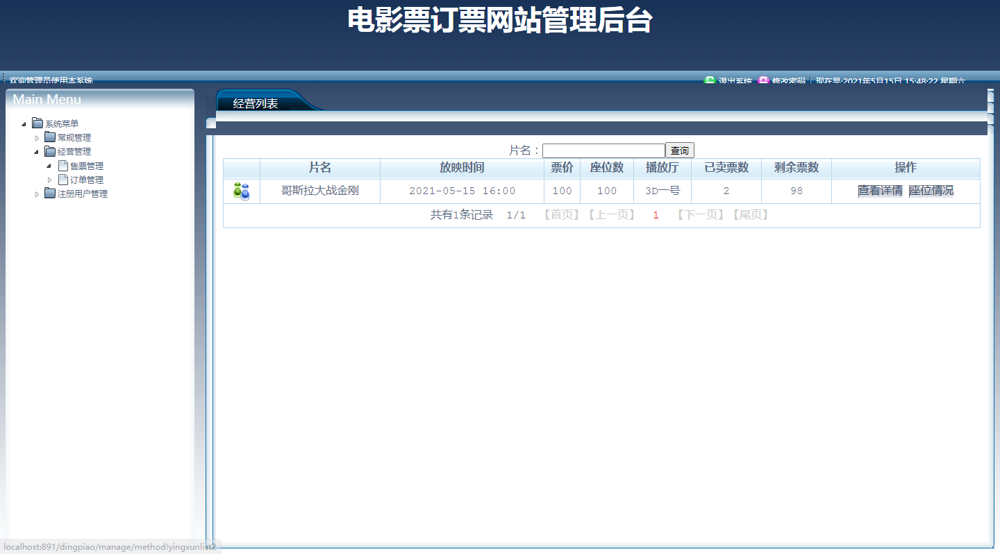
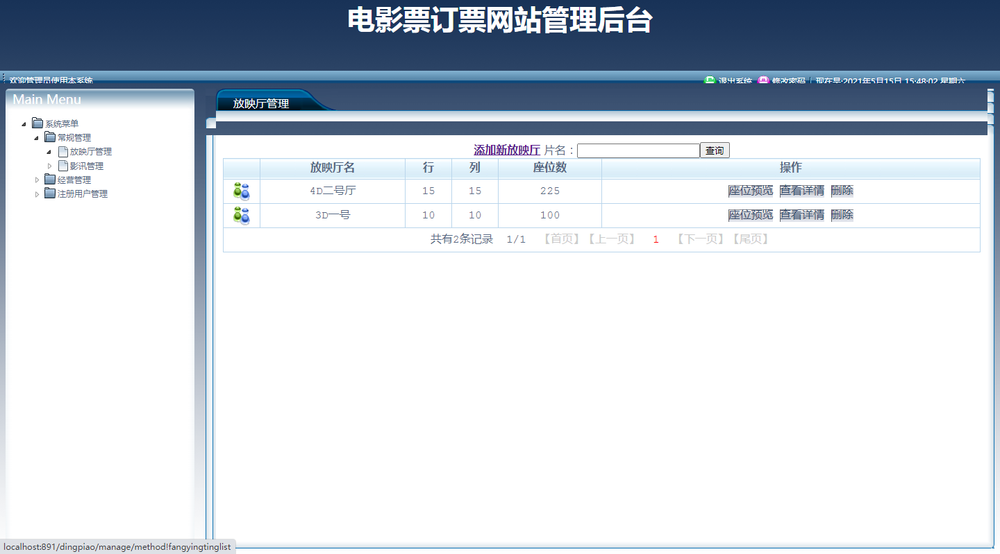
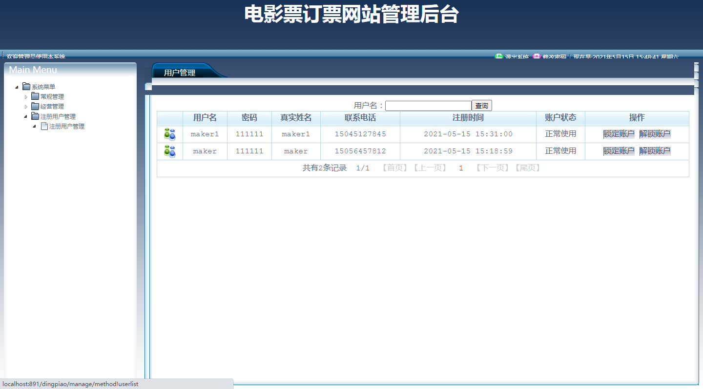
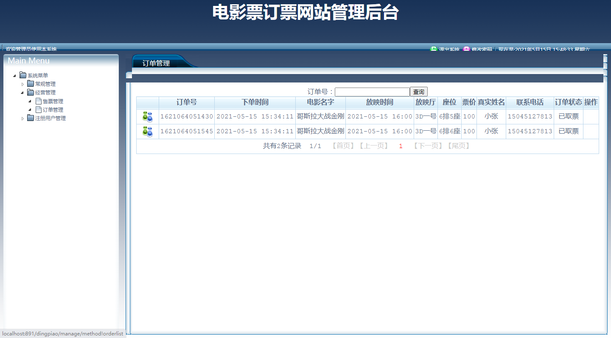
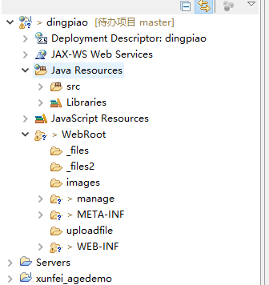
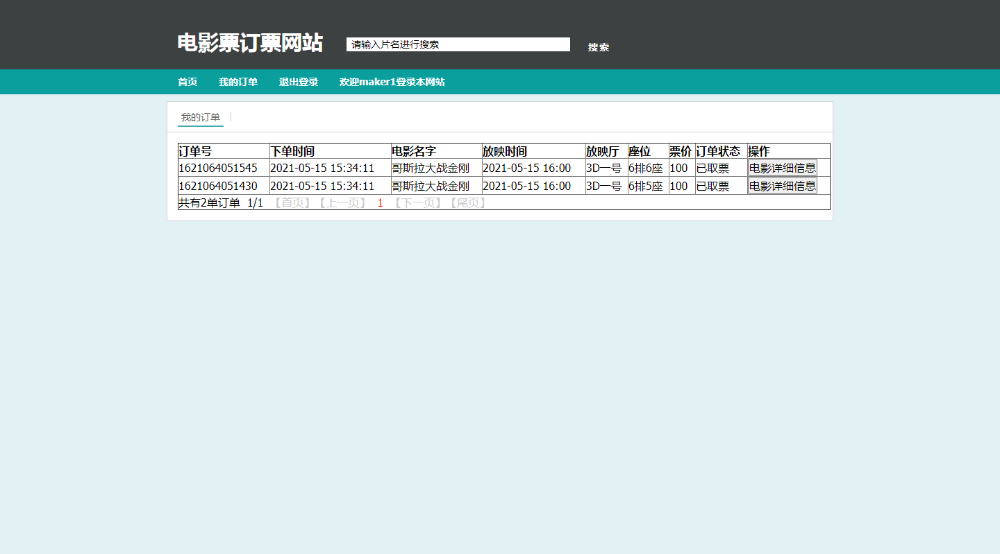
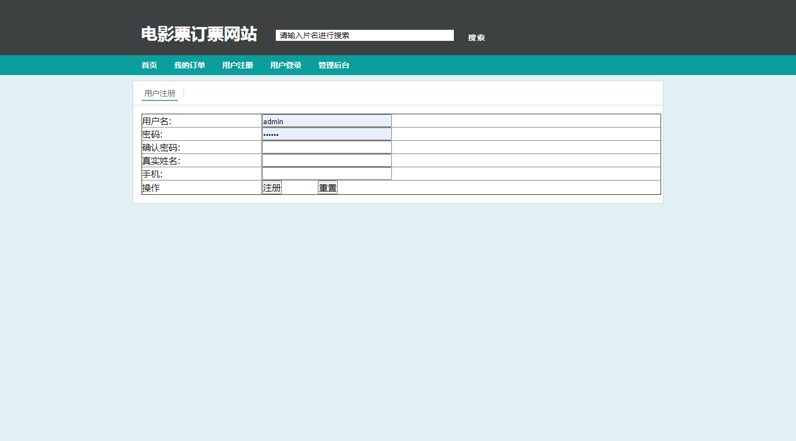
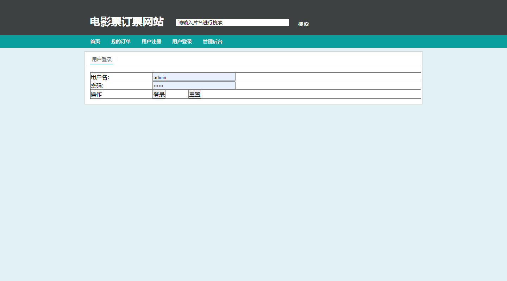
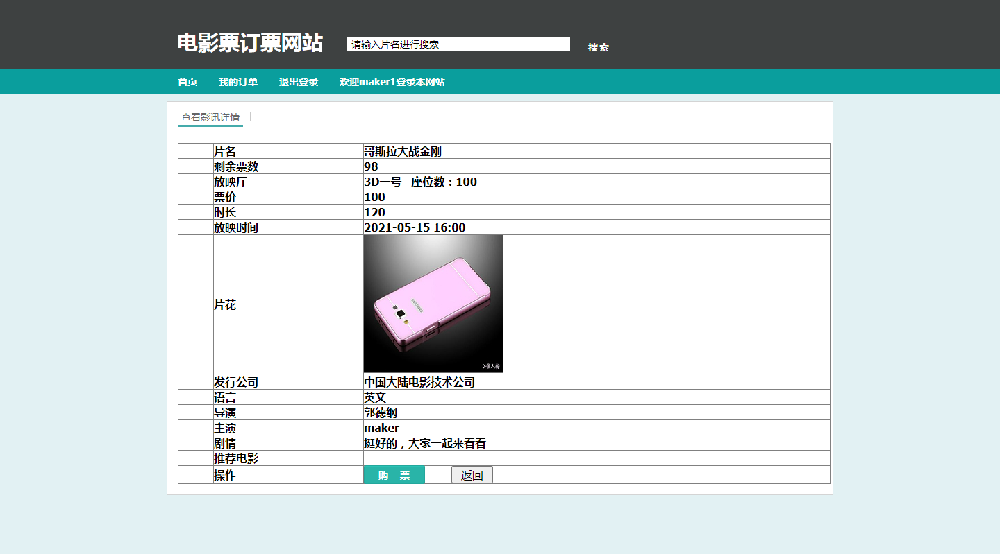
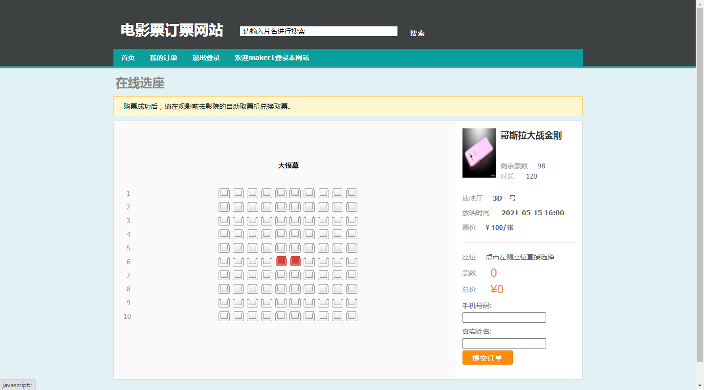

本项目是一个基于ssh的电影购票系统

源码下载地址：http://www.manoncode.cn/details?id=50

技术：ssh+jsp等

功能：
管理员：放映厅管理，电影管理，售票管理，订单管理，用户管理

用户：登陆注册，搜索查询电影，查看电影，在线选座购票，我的订单

CSDN博客地址：[基于ssh的电影购票系统](https://blog.csdn.net/mataodehtml/article/details/116852941)

运行视频地址：[基于ssh的电影购票系统](https://www.bilibili.com/video/BV1CU4y1t7ey)

管理员：

用户：

